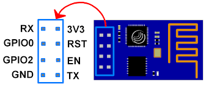
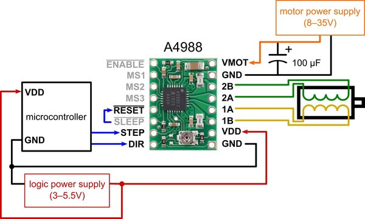
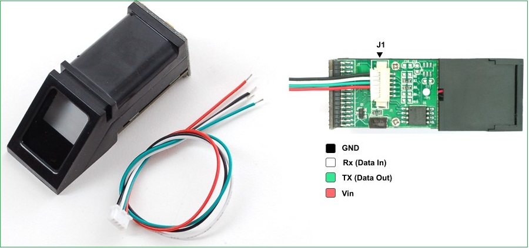

# Smart Home Esp controllers registration and control project

Used components:

+ ESP8266 ESP-01 Microcontrollers
+ Microcomputer running ARM linux
+ Wifi router
+ Relay
+ 3.3v to 5v converter
+ Power adapter and stabilizator for esp microcontroller
+ Patience

## Device and Systems of the project:

+ [x] Lights and light bulbs control
+ [x] Heater control
+ [x] Cooler control
+ [x] Stove control (SIEMENS stove Reverse Engineered :p )
+ [x] Curtain control
+ [x] TV remote control
+ [x] Smart sockets
+ [ ] Window control
+ [x] Water pump control (Water sensor used)
+ [x] Current measurement
+ [x] Water flow measurement
+ [x] CCTV security
+ [x] Fingerprint sensor access control (door builtin)
+ [x] Fingerprint sensor access control (wireless)
+ [x] RFID NFC card access control (Door builtin)
+ [x] SIM900 SMS message control option
+ [x] PIR security sensor devices
+ [x] Face recognition service

--------------

## Documentations:

[Server Side (enUS)](/documentation/server-side_enUS.md)

[Server Side (ruRU)](/documentation/server-side_ruRU.md)

[Server Side (tkTM)](/documentation/server-side_tkTM.md)

[Smart Home (enUS)](/documentation/smart-home_enUS.md)

[Smart Home (ruRU)](/documentation/smart-home_ruRU.md)

[Smart Home (tkTM)](/documentation/smart-home_tkTM.md)


---------------

ESP-01 devices have two active pins - Led output (GPIO 2) and Switch (GPIO 0)

Connect those pins in a correctly by schematics and record ESP's ip-address.
Add ip address to a database of python server app.
Send JSON command to a linux server and let him execute the rest thing.

---------------

# Compile and run the ESP8266 microprocessor code

> check ip addresses to be used
> check devices and device commands

**Esp8266-01** pinout



**NodeMCU-Esp8266** pinout


**A4988 Stepper driver** pinout



**Adafruit Fingerprint Sensor** pinout


----------------

**API Testing commands**

> teting /control/<state>

```bash
curl --header "Content-Type: application/json" \
	--request POST \
	--data '{"command":"test_local","state":1,"action":""}' \
	http://127.0.0.1:5000/esp/
```

> testing /control/?args

```bash
curl --header "Content-Type: application/json" \
	--request POST \
	--data '{"command":"test_local_json","pins":[{"command":"switch_mirror","action":"1"},{"command":"switch_AI","action":"activate"}]}' \
	http://127.0.0.1:5000/esp/JsonToArg/
```


> Browser Get request to raspberry for test:
```url
http://192.168.1.252/esp/ArgToDB/?device_key=<device_key>&command=<sensor_command>&value=<value of water, example 112>
```